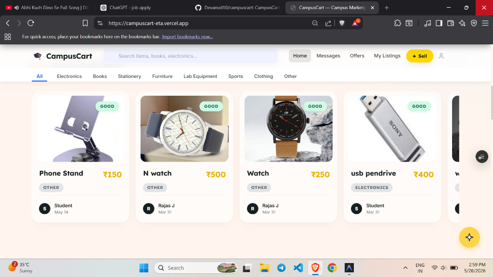
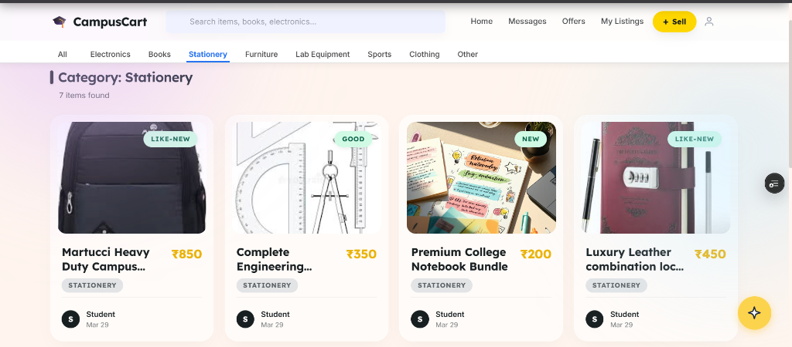
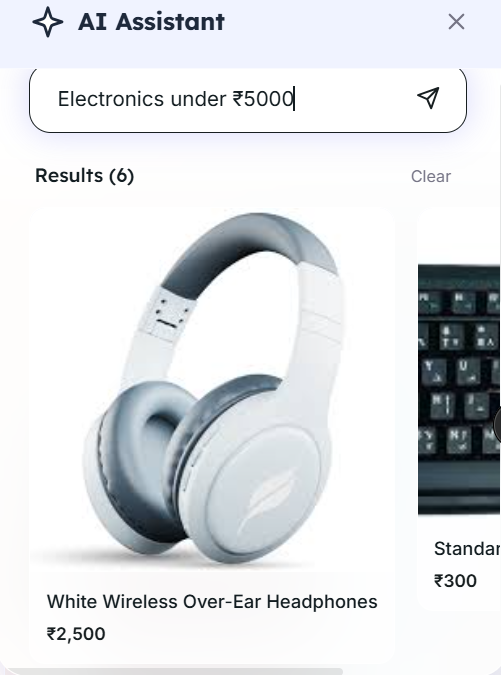
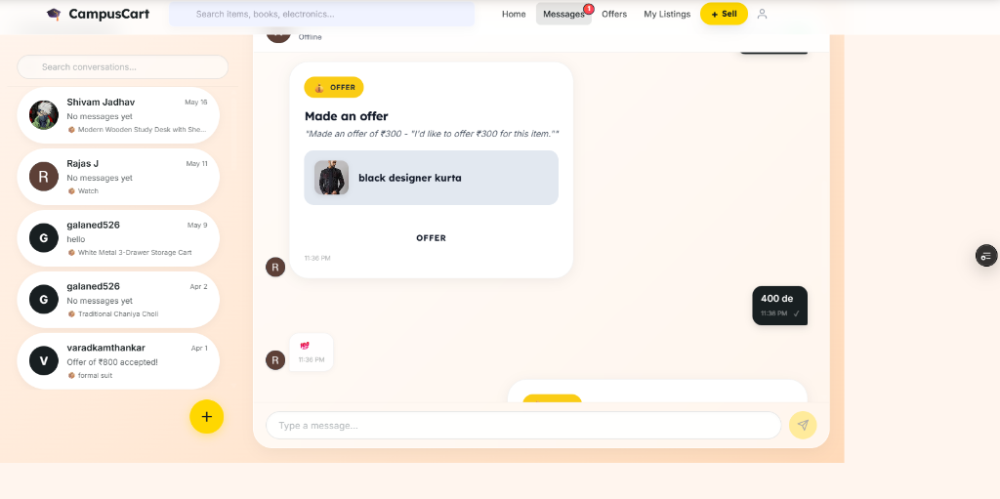
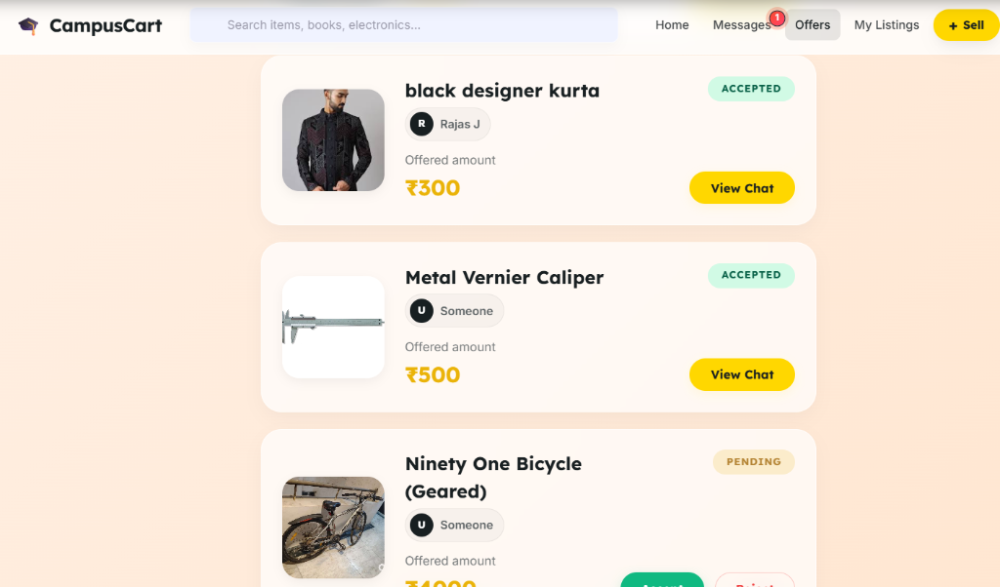
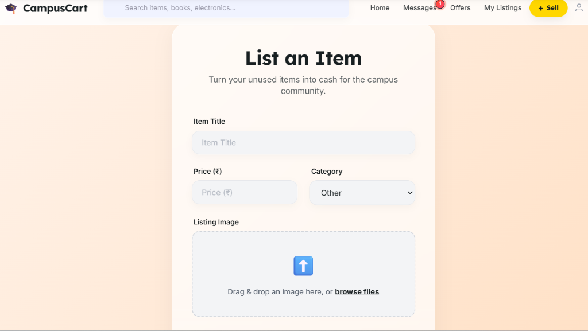
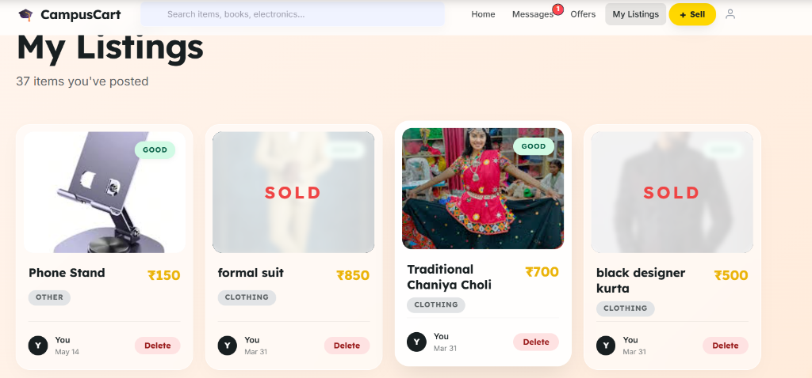

# CampusCart

CampusCart is a secure, campus-centric peer-to-peer student marketplace designed specifically for university communities. By establishing a verified, closed-loop trading network, the platform addresses the trust, proximity, and security issues inherent in general-purpose classified websites like Craigslist, OLX, or Facebook Marketplace. 

Through CampusCart, students can list, buy, sell, and trade campus essentials—ranging from textbooks and calculators to electronics and furniture—safely and conveniently within their local campus borders.

---

## Technical Features

### Closed-Loop Student Verification & Authentication
- **Secure Email Onboarding**: Verification flow requiring institutional email validation before account activation.
- **Federated Authentication**: Integrations with Google and GitHub OAuth providers via Passport.js strategies.
- **Modern Session Management**: Dual-token architecture using Access and Refresh JSON Web Tokens (JWT) stored securely in HTTP-only, SameSite cookies to defend against Cross-Site Scripting (XSS) and Cross-Site Request Forgery (CSRF).

### Dynamic Peer-to-Peer Listings
- **CRUD Operations**: Structured form validation for creating, updating, and removing marketplace listings.
- **Rich Media Management**: Cloud-stored product images handled asynchronously via Multer and persistent storage with the Cloudinary API.
- **Categorization & Condition Grading**: Structured data classification based on condition tiers (`new`, `like-new`, `good`, `fair`, `poor`) and predefined category hierarchies.

### Real-Time Negotiation & Messaging
- **Websocket Connectivity**: Persistent bi-directional communication channels powered by Socket.io.
- **Secure Handshake Protocol**: Connection token handshakes matching authenticated client sessions.
- **Interactive Chat Interface**: Live conversation windows, message read/unread indicators, and instant notification updates.

### Enterprise-Grade Security Architecture
- **API Protection**: HTTP security headers managed via Helmet middleware.
- **Cross-Origin Configuration**: Granular CORS rules restricting backend API access strictly to trusted frontend origins.
- **Rate Limiting**: Custom request-rate throttling configured via `express-rate-limit` to prevent brute-force and Denial-of-Service (DoS) vectors.
- **Input Validation**: Strict request payload sanitization and parsing using `express-validator` to neutralize SQL/NoSQL Injection and XSS attempts.

---

## System Walkthrough & Visual Portfolio

The following viewports showcase the primary product flows and their respective system implementation details:

### 1. Unified Student Marketplace

- **Technical Flow**: Dynamic card grid displaying active listings populated asynchronously from the paginated `/api/listings` REST surface. On page mount, the shell decodes custom JWT payloads (using silent access token rotation via secure Axios interceptors) to verify account status and display relative timestamps.

### 2. Category Routing & Condition Filtering

- **Technical Flow**: Filter state synchronization leveraging React Router (v7) search params, allowing direct deep-linking (e.g., `/marketplace?category=Stationery`). Underlying query speed is kept under `<20ms` utilizing a compound index on `{ category: 1, status: 1 }` within MongoDB.

### 3. Natural Language Search via AI Assistant

- **Technical Flow**: Integrated contextual assistant utilizing the Google Gemini API. Natural language queries like *"Electronics under ₹5000"* are parsed by the backend LLM engine into standard Mongoose relational filter schemas to deliver intent-aware results inside an animated slide drawer.

### 4. Real-Time Chat & Bid Negotiation

- **Technical Flow**: Real-time websocket sessions facilitated by Socket.io. The conversation module handles standard string payloads as well as interactive **Offer Cards**. The bid/ask structure validates user roles to show customized action buttons (Accept/Reject) only to the seller.

### 5. Received & Sent Offers Tracker

- **Technical Flow**: A transactional dashboard compiling student bid agreements. Accepting an offer triggers a cascading state update on Mongoose models (marking listings as `sold` or `reserved`) and dispatches secure transaction emails to both parties using the Brevo API.

### 6. Multi-part Item Listing Upload

- **Technical Flow**: Form validation interface using React control hooks. Staged image binaries are handled backend-side via Multer middleware, which streams incoming file buffers directly to Cloudinary cloud repositories without writing bulky temporary files to server disks.

### 7. Interactive Listings Inventory

- **Technical Flow**: Personal inventory management board showing active and sold listings. Items marked as sold are programmatically grayed out using CSS filter states to signify inactiveness, while providing users direct RESTful deletion controls.

---

## Tech Stack

### Frontend Architecture
- **Core Library**: React 19
- **Build Tool**: Vite (highly optimized bundle compiler)
- **Routing**: React Router Dom (v7, declarative state-based navigation)
- **HTTP client**: Axios (custom-configured with silent JWT refresh interceptors)
- **Animation**: Framer Motion (fluid, declarative transitions)
- **Real-Time Client**: Socket.io-client

### Backend Infrastructure
- **Server Framework**: Node.js & Express 5 (native promise support for enhanced middleware error routing)
- **Database Engine**: MongoDB with Mongoose ORM (v9)
- **Real-Time Server**: Socket.io
- **Logger**: Winston (configured with daily log-file rotation for production tracing)
- **Email Service**: Brevo Transactional Email API (integrated via Nodemailer client)

---

## Directory Structure

```text
campuscart/
├── client/                     # React Frontend Application
│   ├── src/
│   │   ├── components/         # Reusable UI component library
│   │   ├── pages/              # Primary route views and shell pages
│   │   ├── hooks/              # Custom React hooks (e.g., useChat)
│   │   ├── services/           # Axios API configuration & Interceptors
│   │   └── styles/             # Modular Vanilla CSS rules
│
├── server/                     # Express Backend API Application
│   ├── config/                 # DB connectors & Passport strategy setups
│   ├── controllers/            # Controller layer containing business logic
│   ├── middlewares/            # Auth validation, error handler, rate limits
│   ├── models/                 # Mongoose database schemas & indexes
│   ├── routes/                 # Express API endpoints
│   ├── utils/                  # Utility functions (tokens, mailer)
│   └── server.js               # Application entry point & server bootstrap
```

---

## Run Locally

Follow these guidelines to set up a local development copy of CampusCart.

### Prerequisites
- Node.js (v18 or higher recommended)
- npm or yarn package manager
- A running MongoDB instance (or MongoDB Atlas cluster URI)
- Cloudinary developer API keys
- Brevo (or compatible SMTP) account credentials

### Installation Steps

1. **Clone the Repository**
   ```bash
   git clone https://github.com/your-username/campuscart.git
   cd campuscart
   ```

2. **Install Workspace Dependencies**
   
   Install dependencies for the backend:
   ```bash
   cd server
   npm install
   ```

   Install dependencies for the frontend:
   ```bash
   cd ../client
   npm install
   ```

3. **Set Up Environment Files**
   Configure your environment variables as detailed in the section below. Create a `.env` file in the `/server` directory and a `.env` file in the `/client` directory.

4. **Launch the Development Servers**

   Start the Backend API Server:
   ```bash
   # From the server directory
   npm run dev
   ```
   *The server defaults to: `http://localhost:5000` (or `http://localhost:10000` depending on configuration)*

   Start the Frontend Client:
   ```bash
   # Open a separate terminal, navigate to the client directory
   npm run dev
   ```
   *The client defaults to: `http://localhost:5173`*

---

## Environment Variables

### Backend Configuration (`server/.env`)

| Variable | Description | Example / Value |
| :--- | :--- | :--- |
| `NODE_ENV` | Run context of the application | `development` / `production` |
| `PORT` | Local server port binding | `5000` |
| `MONGO_URI` | Connection URI for the MongoDB instance | `mongodb+srv://...` |
| `SESSION_SECRET` | Secret key for Express session hashing | `your_session_secret` |
| `ACCESS_TOKEN_SECRET` | HMAC signature secret for access JWTs | `your_access_token_secret` |
| `CLIENT_URL` | Cross-Origin authorized frontend URL | `http://localhost:5173` |
| `BASE_URL` | Self-referencing backend server URL | `http://localhost:5000` |
| `EMAIL_FROM` | Dispatcher address for transactional emails | `noreply@campuscart.com` |
| `EMAIL_USER` | SMTP server connection username | `smtp_username` |
| `EMAIL_PASS` | SMTP server connection password | `smtp_password` |
| `BrevoApiKey` | Brevo API key for SMTP dispatch | `xkeysib-...` |
| `GOOGLE_CLIENT_ID` | OAuth2 Google Client Identifier | `google_oauth_client_id` |
| `GOOGLE_CLIENT_SECRET`| OAuth2 Google Secret Key | `google_oauth_client_secret` |
| `GITHUB_CLIENT_ID` | OAuth2 GitHub Client Identifier | `github_oauth_client_id` |
| `GITHUB_CLIENT_SECRET`| OAuth2 GitHub Secret Key | `github_oauth_client_secret` |
| `CLOUDINARY_CLOUD_NAME`| Cloudinary target cloud workspace name | `your_cloud_name` |
| `CLOUDINARY_API_KEY` | Cloudinary REST API Key | `your_cloudinary_api_key` |
| `CLOUDINARY_API_SECRET`| Cloudinary REST API Secret | `your_cloudinary_api_secret` |

### Frontend Configuration (`client/.env`)

| Variable | Description | Example / Value |
| :--- | :--- | :--- |
| `VITE_API_URL` | Target address of the active Backend API | `http://localhost:5000` |

---

## Key Learnings

Building CampusCart highlighted critical system engineering design choices and trade-offs:

1. **Robust Authentication via Axios Interceptors**
   Implementing a silent, double-token authentication cycle required deep alignment between client and server. By writing clean interceptors in `client/src/services/api.js`, the client intercepts `401 Unauthorized` responses, refreshes the access token via secure cookies in the background, and replays failed API requests transparently without degrading the user experience.

2. **Websocket Handshake Token Verification**
   Managing real-time messaging required strict websocket authorization. Establishing the handshakes through a token validation route (`/api/auth/token`) instead of sending pure API secrets over permanent sockets ensured a hardened connection phase, minimizing unauthorized channel listening.

3. **Compound Database Indexing Strategies**
   Optimizing MongoDB Mongoose queries was necessary for keeping the application scalable. Implementing compound indexes such as `{ category: 1, status: 1 }` on the Listings collection and `{ participants: 1, lastMessageAt: -1 }` on the Conversations collection greatly minimized database collection scans, maintaining fast sub-100ms lookup latency during search and feed updates.

4. **Structured Multi-part File Handlers**
   Handling direct binary image uploads via `multer` required careful buffer management. Streamlining files immediately to Cloudinary's servers without keeping heavy temporary files on the local API disk optimized physical memory usage, maintaining high API server availability under continuous load.

---

## Future Improvements

- **Payment Gateway Integration**: Direct transaction processing by integrating with Razorpay API endpoints.
- **Escrow-Holding Accounts**: Smart escrow contract flows where funds are safely locked until the buyer confirms physical item handoff on campus.
- **Student Peer Ratings**: A verification review score system enabling students to rate their transaction experience with buyers and sellers, fostering safety.
- **AI-Powered Product Categorization**: Incorporating Google's Gemini API on listing creation steps to suggest optimal pricing models and auto-categorize catalog entries based on descriptions and images.

---

## Live Demo

- **Frontend Client Web App**: [https://campuscart-client.netlify.app](https://campuscart-client.netlify.app) *(Update with your production client URL)*
- **Backend API Endpoint**: [https://campuscart-api.onrender.com](https://campuscart-api.onrender.com) *(Update with your production server URL)*
